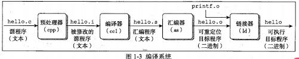
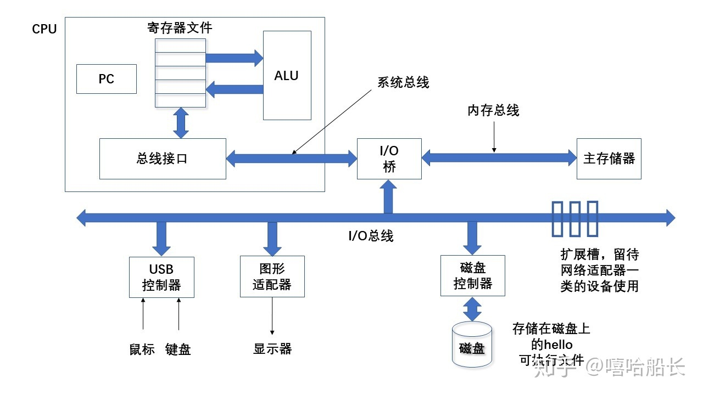
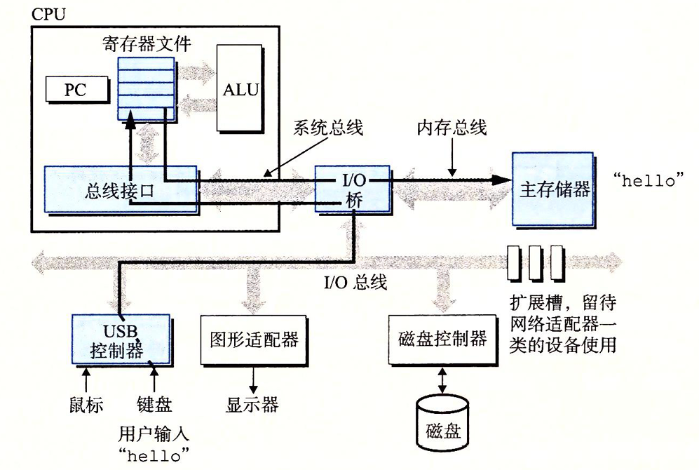
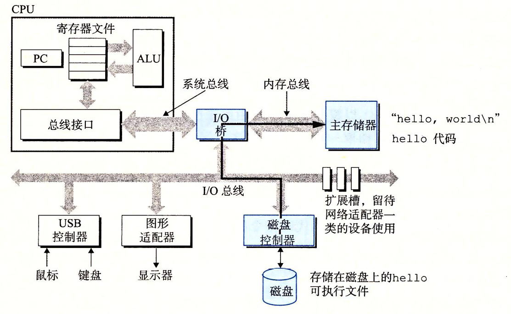
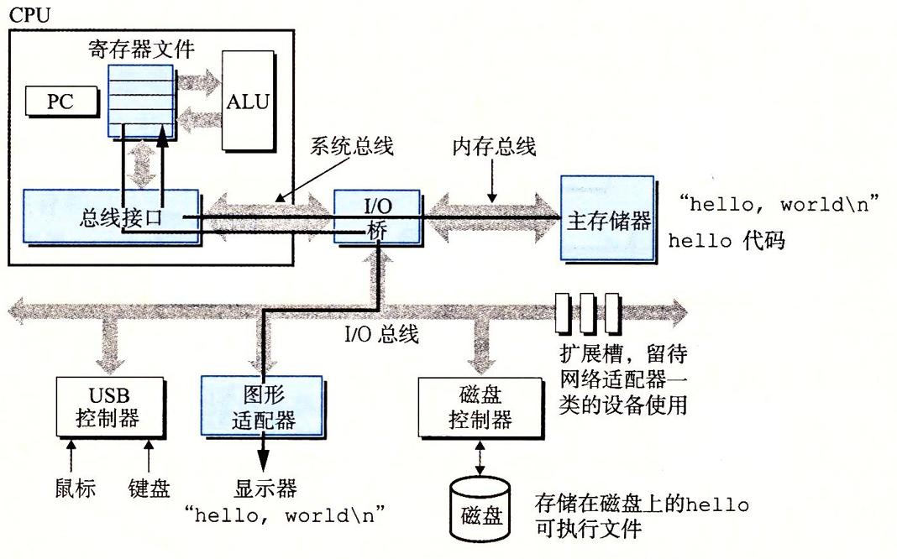

# 计算机系统漫游

**计算机系统**是由硬件和系统软件构成,他们共通工作来运行程序.虽然系统的具体实现方式随着时间不断变化.但系统内在概念一直没有变化.从某种意义上来说,本书就是致力于帮助你理解当系统执行下面这一段 hello 程序的时候,系统发生了什么事情.

```c
#include <stdui.h>

int main()
{
  printf("hello, world\n");
  return 0;
}
```

## 1.1 信息就是位+上下文

我们通过跟踪上面代码的生命周期,程序从编辑器创建开始,到编译成源代码,二进制,源代码实际上就是 01 组成的二进制比特文件.8bit 组成一个 byte,每个字节表示某些文本字符.上面代码每一行以看不见的`\n`为换行符结束.

## 1.2 程序被其他程序翻译成不同的风格

hello 程序的生命周期是从一个高级的 c 语言开始的,因为这种形式可以容易被读懂.其实就是转化成可执行二进制程序, 也就是转化成机器能读懂的机器码.

编译成机器码可分为四个阶段:

- **预处理阶段** 预处理器(cpp)根据字符#开头的命令,修改原始的 c 程序.比如`hello.c`中的第一行`# include <stdio.h>`命令告诉预处理器读取系统头部`studio.h`的内容,并把他们直接插入到程序文本中,然后就得到了另一个程序,`hello.i`

- **编译阶段** 编译器(ccl)将文本文件`hello.i`编译成文本文件`hello.s`,它包含一个汇编语言程序.该程序函数 main 的定义,如下:

  ```s
  main:
    subq  $8, %rsp
    movl  $.LCO, %edi
    call  puts
    movl  $0, %eax
    addq  $8, %rsp
    ret
  ```

  上面代码中的每一句都是 以一种文本格式描述了一跳低级机器指令语言指令.汇编语言是非常有用的,他们为不同的高级语言的不同编译器提供了通用的输出语言.例如 C 编译器和 Fortran 编译器产生的输出文件都是一眼的汇编语言.

- **汇编阶段** 汇编器将 hello.s 翻译成机器语言指令,并把这些结果保存在目标文件 `hello.o` 中

- **链接阶段** 请注意,hello 程序调用了 printf 函数,这是 c 的函数库,`printf`函数存在于一个名为`printf.o`的文件中,链接器负责这种合并.最终得到可执行程序`hello`.他可以直接被加载到内存中.由系统执行.



## 1.3 了解编译系统如何工作是大有益处的

对于想 hello.c 这样的简单的程序.我们可以依靠编译器,生成有效的可执行的机器代码.但是直到编译器工作原理可以帮助我们更高效的工作.

- **优化程序性能** 普通程序员自然不需要了解编译器工作原理, 但是 c 程序员需要了解.

  - 比如一个`switch`是否比一系列`if-else`更加高效?
  - 指针索引是否比数组索引更加高效?一个函数调用的开销有多大?
  - while 循环比 for 循环更高效吗?为什么
  - 为什么循环求和的结果放在一个本地变量中比放在一个通过引用传递过来的参数中更加高效.
  - 为什么我们只是简单的重新排列一下算数表达式中的括号的顺序就能让算数表达式运行速度快很多.

- **理解链接时出现的错误** 根据我们的经验,一些令人困扰的程序错误往往都与链接器的操作有关.

- **避免安全漏洞** 多年来,缓冲区溢出错误是造成大多数网络漏洞和 `internet` 服务器上安全漏洞的主要原因. 存在这些漏洞的原因是很少程序员理解需要从不受信任的源接受数据的数量和格式.学习安全编程的第一步就是理解数据和控制信息存在程序栈上引发的后果

## 1.4 处理器读取并解释存储在内存中的指令

此刻,hello.c 源码已经被编译成可执行文件 hello.并被存放在磁盘上,本章节用于解释下面操作的过程

```bash
linux> ./hello
hello,world
linux>
```

### 1.4.1 系统的硬件组成

为了理解运行 hello 程序时,发生了什么,我们先了解一个典型的系统的硬件阻止,如图所示



- **总线** 贯穿整个系统的是一组电子管道,成为总线.它携带信息字节并负责在各个部件之间传递.通常总线被设计成传递特定长度的 byte,也就是字(word).byte 中的 bit 是一个基本系统参数,各个系统中都不尽相同.现在大多数机器 byte 要么是 4 个字节(32 位系统),要么是 8 个字节(64 位系统).本书中,我们不对字长做任何固定假设,我们会在上下文中明确每个 byte 是多大.

- **I/O 总线** I/O 设备是系统与外部世界沟通通道.我们有 4 个 I/O 设备,鼠标,键盘输入 , 显示器输出, 磁盘存储,从最开始,可执行程序 hello 就放在磁盘中.
  每一台 I/O 设备都通过一个控制器或者适配器与 I/O 总线相连.控制器和适配器之间的区别,主要在于他们的封装方式,

  - **控制器** 就是 I/O 设备本身或者系统的主印制电路板上面的芯片组.
  - **适配器** 插在主板插槽上的卡.

- **主存** 即临时存储设备,

  - 从物理上说,就是动态随机存储器(DRAM)
  - 从逻辑上来说,存储器是一个线性的字节数组,每个字节都有一个唯一地址(数组索引),这个地址从 0 开始.

- **处理器** 即 CPU,是解释存储在主存中的指令的引擎

  - **程序计数器(PC)** 核心是一个大小为一个字的存储设备,在任何时刻 PC 都指向主存中某条机器语言指令(即含有该条指令的地址),从开始到结束,处理器一直在不停地知悉女程序计数器指向的指令,在更新程序,使其指向下一条指令,这条指令不一定和上一条指令相邻.

  - **寄存器文件(register file)** 它是一个小的存储设备,由一些单个字长的寄存器组成,每个寄存器都有唯一的名字.

  - **算术/逻辑单元(ALU)** ALU 计算数据和地址,下面是一些 简单操作
    - **加载:** 从主存复制一个字节或者一个字到寄存器,用来覆盖原先寄存器的内容.
    - **存储:** 从寄存器复制一个字节或者一个字到主存的某个位置,以覆盖原先这个位置上面的内容.
    - **操作** 吧两个寄存器的内容复制到 ALU,ALU 对这两个字做算数运算,并将结果放到寄存器中,以覆盖寄存器中原先的内容
    - **跳转** 从指令本身抽中一个字,并将这个字复制到程序计数器(PC)中,以覆盖 PC 中原来的值.

### 1.4.2 运行 hello 程序

初始化时候, shell 键入命令, 等待下一个命令,输入`./hello`后,shell 程序会将字符逐一读入寄存器,再把它存在内存中


这个时候加载文件到内存


运行内存中的程序


## 1.7 操作系统管理硬件

当我们运行 hello 的时候,shell 和 hello 程序都没有直接访问键盘,鼠标显示器,磁盘主存,取而代之的是,他们依靠操作系统提供的服务.我们可以吧操作系统看成

操作系统的两个基本功能

- 防止硬件被失控的应用滥用
- 向应用程序提供简单一致的机制来控制复杂而通常不同的低级硬件设备

操作系统依靠几个基本的抽象概念(进程,虚拟内存和文件)来实现这两个功能.

文件是对 I/O 设备的抽象表示,虚拟内存是对主存和磁盘 I/O 设备的抽象表示,

进程则是对处理器,内存和 I/O 设备的抽象表示.

### 1.7.1 进程

在 hello 运行的时候,操作系统提供一种假象,好像系统上只运行这个程序,程序像是独占处理器,主存和 I/O 设备,处理器看上去就像在不间断的一条接一条的执行程序中的命令,进程是**计算机科学中最重要最成功的概念之一**.

进程是操作系统对一个正在运行的程序的一种**抽象**,一个系统上可以运行多个进程,每个进程像是独占的使用程序,但实际上是并发运行的,

操作系统保持跟踪进程运行所需要的所有状态信息,这种状态就是上下文.任何一个时间,单核处理器都只能执行一个进程代码,当前操作系统把控制权从当前进程转移到某个新进程就是**上下文切换**,即保存当前进程上下文,恢复新进程的上下文,然后将控制权传递给新进程.新进程就会从上一次停止的地方开始.这个过程由**内核(kernel)**管理.

### 1.7.2 线程

一个进程由多个线程组成,每个线程都运行在进程的上下文中,共享同样的代码,和全部数据,,由于网络的并行处理要求,线程优异于进程,他们共享数据,同时线程比进程高效,当有多处理器可用,多线程可以加速程序,

### 1.7.3 虚拟内存

虚拟内存是一个抽象概念,它给进程提供看了一个假象,每个进程独占使用主存,,每个进程看到的内存都是一样的,称之为虚拟空间,
虚拟空间最上层是保留给操作系统中的代码和数据,这对于所有进程都一样,地址底部存放用户定义的代码数据,地址从下往上增大,下面从下往上介绍

- **程序代码和数据** 的对于所有进程,代码从统一固定地址开始,紧接着是 c 的全局变量,和数据,

- **堆** 代码和数据区域之后紧随的是运行时候的堆,这一层是 C 标准库,

- **共享库** c 标准库和数学库这样的共享代码,

- **栈** 位于用户虚拟地址顶部的是用户栈,可在**程序执行阶段**动态收缩.
- **内核虚拟内存** 地址空间顶部区域是为内核保留

### 1.7.4 文件

文件就是字节序列,每个I/O设备都是文件.这个功能非常强大.

## 1.8 系统之间利用网络通信

网络就是I/O设备,