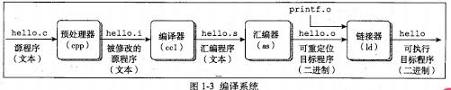

# 计算机系统漫游

**计算机系统**是由硬件和系统软件构成,他们共通工作来运行程序.虽然系统的具体实现方式随着时间不断变化.但系统内在概念一直没有变化.从某种意义上来说,本书就是致力于帮助你理解当系统执行下面这一段 hello 程序的时候,系统发生了什么事情.

```c
#include <stdui.h>

int main()
{
  printf("hello, world\n");
  return 0;
}
```

## 1.1 信息就是位+上下文

我们通过跟踪上面代码的生命周期,程序从编辑器创建开始,到编译成源代码,二进制,源代码实际上就是 01 组成的二进制比特文件.8bit 组成一个 byte,每个字节表示某些文本字符.上面代码每一行以看不见的`\n`为换行符结束.

## 1.2 程序被其他程序翻译成不同的风格

hello 程序的生命周期是从一个高级的 c 语言开始的,因为这种形式可以容易被读懂.其实就是转化成可执行二进制程序, 也就是转化成机器能读懂的机器码.

编译成机器码可分为四个阶段:

- **预处理阶段**  预处理器(cpp)根据字符#开头的命令,修改原始程序c,比如`#include <stdui.h>` 这个命令就是要告诉预处理器读取系统文件`studio.h`部分,并插入文本内.得到第二个c成语 `hello.i`,
- 编译器
  
- 汇编器
- 链接器


